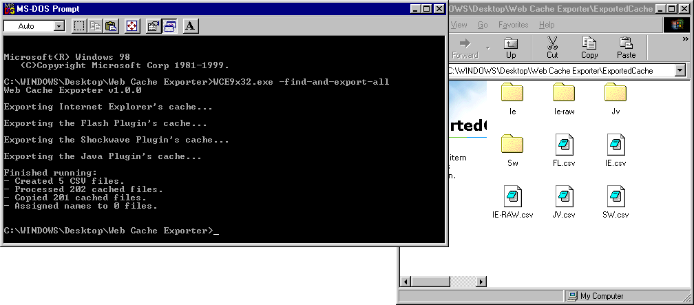
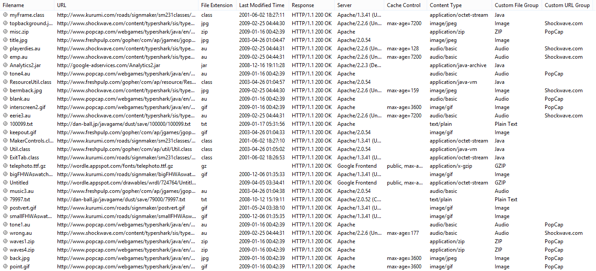
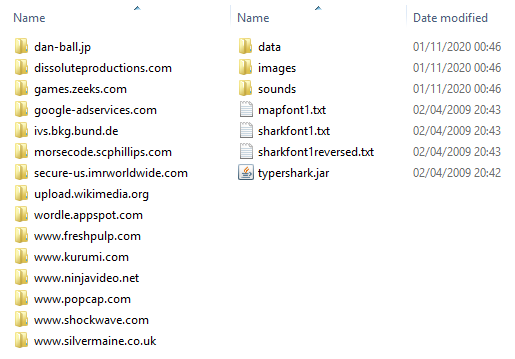
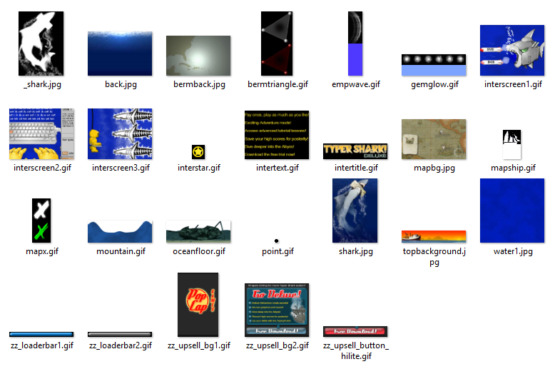

# Web Cache Exporter

This command line tool allows you to more easily view and obtain the contents of a web browser or web plugin's HTTP cache that's stored on disk. It runs on Windows 98, ME, 2000, XP, Vista, 7, 8.1, and 10, and supports the following cache formats:

* The WinINet cache - Internet Explorer 4 to 11.
* The Flash Player's shared library cache and temporary Flash videos.
* The Shockwave Player's cache, including Xtras.
* The Java Plugin's cache - Java 1.3 to 8.

This tool was developed to aid the [recovery and preservation of lost web media](https://bluemaxima.org/flashpoint/) (games, animations, virtual worlds, etc) whose files might exist in old computers where they were viewed/played when they were still available.

For example, [here's a list of some previously lost browser games that were found by searching the web cache](https://bluemaxima.org/flashpoint/datahub/Recovering_Files_from_Browser_Cache#List_of_games_found_by_searching_the_web_cache).

## Features

* Finds and exports the cache by copying the cached files using their original website's directory structure, and by generating a CSV file that lists each one along with additional information (filename, URL, HTTP headers, etc).





* Supports labelling cached files based on their file signatures, MIME types, file extensions, and URLs. Files can be grouped and filtered by their format or original domain.





## Command Line Arguments

This utility includes three executables:
* **WCE9x32.exe** for Windows 98 and ME (32-bit).
* **WCE32.exe** for Windows 2000, XP, Vista, 7, 8.1, and 10 (32-bit).
* **WCE64.exe** for Windows XP, Vista, 7, 8.1, and 10 (64-bit).

The command line arguments in the next subsections may be used. **WCE.exe** is used to refer to any of these three executables.

Usage:
```
WCE.exe [Other Optional Arguments] <Mandatory Export Argument>
```

Only one export argument may be used. All arguments after the first export option are ignored.

When executed, this tool will create a log file called `WCE.log` in the current working directory. The generated log and CSV files use UTF-8 as their character encoding.

### Export Arguments

The following options can take two arguments:
```
WCE.exe -export-option [Optional Cache Path] [Optional Output Path]
```

If a path is empty or not specified, then the application will replace it with a default value. For the cache path, this includes several default locations that vary depending on the browser or plugin. For the output path, this value is set to "ExportedCache".

You can use "." to refer to the current working directory's path. Note that all paths passed to this application are limited to 260 characters.

The names of the output folder and CSV file depend on the export option (see the "Output Name" columns below). For example, using `-export-ie` would create a directory called `IE` and a CSV file called `IE.csv` in the output path.

| Option            | Description                                                                        | Output Name |
|-------------------|------------------------------------------------------------------------------------|-------------|
| -export-ie        | Exports the WinINet cache, including Internet Explorer 4 to 11.                    | IE          |
| -export-flash     | Exports the Flash Player's shared library cache and temporary Flash videos.        | FL          |
| -export-shockwave | Exports the Shockwave Player's cache, including Xtras.                             | SW          |
| -export-java      | Exports the Java Plugin's cache from Java 1.3 to 8.                                | JV          |

For example:
```
WCE.exe -export-ie
WCE.exe -export-flash "C:\PathToTheCache"
WCE.exe -export-shockwave "C:\PathToTheCache" "My Cache"
WCE.exe -export-java "" "My Default Cache"
```

When exporting Internet Explorer 4 to 9's cache, this tool will also create a second output folder and CSV file called `IE-RAW`. This is done to copy files that might still exist on disk despite not being listed in the cache database. Exporting the cache from Internet Explorer 10 and 11 is only supported in Windows Vista and later.

There are two other options that have a similar behavior but that take different arguments:

| Option               | Description                                              | Output Name       |
|----------------------|----------------------------------------------------------|-------------------|
| -find-and-export-all | Exports all of the above at once.                        | &lt;See Above&gt; |
| -explore-files       | Exports any files in a directory and its subdirectories. | EXPLORE           |

The `-find-and-export-all` option can take two arguments:
```
WCE.exe -find-and-export-all [Optional Output Path] [Optional External Locations File Path]
```

This option is used to export every supported cache format from their default locations at the same time. The second optional argument specifies a text file that allows you to set these default locations and perform this operation multiple times. This is useful when you want to export the web cache from multiple user profiles located in an old computer's files. To learn how to use this feature, see the [About External Locations](Source/ExternalLocations/About%20External%20Locations.txt) help file.

For example:
```
WCE.exe -find-and-export-all
WCE.exe -find-and-export-all "My Default Cache"
WCE.exe -find-and-export-all "My Default Cache" "C:\PathToExternalLocationsFile"
```

The `-explore-files` option can take two arguments:
```
WCE.exe -explore-files <Mandatory Cache Path> [Optional Output Path]
```

This option may be used to explore the files in an unsupported cache location (e.g. from an obscure web plugin), meaning the first argument must always be passed. This feature is useful when combined with [group files](#group-files). You can also use the `-no-copy-files` option to only create the CSV file and prevent a large number of files from being copied.

For example:
```
WCE.exe -explore-files "C:\PathToExplore"
WCE.exe -no-copy-files -explore-files "C:\PathToExplore" "My Exploration"
```

### Other Arguments

These extra command line arguments are optional. The **-export-option** argument is used to refer to any of the previous export options.

The following options don't require any additional arguments.

| Option           | Description                                                                           |
|------------------|---------------------------------------------------------------------------------------|
| -no-copy-files   | Stops the exporter from copying files.                                                |
| -no-create-csv   | Stops the exporter from creating CSV files                                            |
| -overwrite       | Deletes the previous output folder of the same name before running.                   |
| -show-full-paths | Replaces the "Location On Cache" CSV column with the cached file's full path on disk. |

Using both `-no-copy-files` and `-no-create-csv` will result in an error and terminate the application.
The `-show-full-paths` option does nothing if `-no-create-csv`is also used.

For example:
```
WCE.exe -no-copy-files -show-full-paths -export-option
WCE.exe -no-create-csv -overwrite -export-option
```

The following options change how [group files](#group-files) behave.

| Option                                | Description                                      |
|---------------------------------------|--------------------------------------------------|
| -filter-by-groups                     | Only exports files that match any loaded groups. |
| -load-group-files &lt;Group Files&gt; | Only loads specific group files.                 |

The &lt;Group Files&gt; argument is mandatory and specifies a filename list, where each one is separated by spaces and without the .group file extension. All group files are loaded by default. This tool will always look for group files in the "Groups" subdirectory in the executable's directory (and not in the current working directory).

For example:
```
WCE.exe -filter-by-groups -load-group-files "006-Plugin 101-Gaming-Websites" -export-option
```

This would load the group files "006-Plugin.group" and "101-Gaming-Websites.group", and would filter the output based on the groups that they define.

The following options should only be used when exporting the WinINet cache using `-export-ie` or `-find-and-export-all`.

| Option                            | Description                                                                                         |
|-----------------------------------|-----------------------------------------------------------------------------------------------------|
| -hint-ie &lt;Local AppData Path&gt; | Specifies the absolute path to the Local AppData folder in the computer where the cache originated. |

The &lt;Local AppData Path&gt; argument is mandatory. This option should only be used if both of the following are true:
1. You're exporting the cache from Internet Explorer 10 and 11.
2. You're not exporting from a default location, i.e., if the cache database files were copied from another computer.

If this is option is not used, the exporter will try to guess this location. You should rerun this application with this option if you meet the criteria above and you notice that some cached files were not exported.

For example:
```
WCE.exe -hint-ie "C:\Users\My Old PC\AppData\Local" -export-ie "C:\Path To The Cache Database Files That Came From Another Computer"
```

## Group Files

Group files are simple text files that tell the application how to label each cached file. Each file may be labelled based on its format or on its original domain. Below are two examples, one file group for Flash movies and one URL group for the Cartoon Network website:

```
BEGIN_FILE_GROUP Flash

	BEGIN_FILE_SIGNATURES
		; "FWS" (uncompressed SWF)
		46 57 53
		; "CWS" (ZLIB compressed SWF)
		43 57 53
		; "ZWS" (LZMA compressed SWF)
		5A 57 53
	END

	BEGIN_MIME_TYPES
		application/x-shockwave-flash
		application/vnd.adobe.flash-movie
		application/futuresplash
		application/x-swz
	END

	BEGIN_FILE_EXTENSIONS
		swf spl
		fla
		swz
	END

END

BEGIN_URL_GROUP Cartoon Network

	BEGIN_DOMAINS
		cartoonnetwork.com
		turner.com/toon
	END

END
```

To learn more about file and URL groups, see the [About Groups](Source/Groups/About%20Groups.txt) help file.

## Building

This application is compiled using the **[Build.bat](Build.bat)** batch file. See the comments at the top of this file to learn how to use and set each basic build parameter. This file is executed using the following syntax: `Build.bat [Optional Compiler Arguments]`. For example:

```
Build.bat
Build.bat /D EXPORT_EMPTY_FILES
```

In order to target Windows 98 and ME, this program is compiled using Visual Studio 2005. It's possible to skip building `WCE9x32.exe` and use Visual Studio 2015 or later by doing the following:

* Setting `VCVARSALL_PATH` to the path of the `vcvarsall.bat` batch file that is installed with Visual Studio.
* Setting `WIN9X_BUILD` to `No`.
* Setting `USE_VS_2005_OPTIONS` to `No`.

Note that this application hasn't been thoroughly tested with modern versions of Visual Studio.

### Dependencies

This tool uses Microsoft's Extensible Storage Engine (ESE) API to export later versions of the WinINet cache. As such, the header file `esent.h` is required to build this application. For later versions of Visual Studio, this file is already part of the Windows SDK. For Visual Studio 2005, this file must be obtained from somewhere else and added to [this source directory](Source/ThirdParty/Include) before building. For this project, this file was taken from the [Windows Vista SDK](https://www.microsoft.com/en-eg/download/details.aspx?id=1919) and is not included in this repository.

## Resources And Tools

This section will list some resources and tools that were used to learn how to process certain cache formats and to validate this application's output.

### Internet Explorer

* [The INDEX.DAT File Format](https://www.geoffchappell.com/studies/windows/ie/wininet/api/urlcache/indexdat.htm)
* [MSIE Cache File (index.dat) format specification](https://github.com/libyal/libmsiecf/blob/master/documentation/MSIE%20Cache%20File%20%28index.dat%29%20format.asciidoc)

* [NirSoft - IECacheView v1.58 - Internet Explorer Cache Viewer](https://www.nirsoft.net/utils/ie_cache_viewer.html)
* [NirSoft - A few words about the cache / history on Internet Explorer 10](https://blog.nirsoft.net/2012/12/08/a-few-words-about-the-cache-history-on-internet-explorer-10/)
* [NirSoft - Improved solution for reading the history of Internet Explorer 10](https://blog.nirsoft.net/2013/05/02/improved-solution-for-reading-the-history-of-internet-explorer-10/)

### Other

* [Geoff Chappell's software analysis website](https://www.geoffchappell.com) was also used to check the minimum supported Windows version for some functions in the Windows API.

* [NirSoft's CSVFileView](https://www.nirsoft.net/utils/csv_file_view.html) is a useful lightweight tool for viewing the resulting CSV files.

* See also [NirSoft's browser tools](https://www.nirsoft.net/web_browser_tools.html), including [ChromeCacheView](https://www.nirsoft.net/utils/chrome_cache_view.html), [MZCacheView](https://www.nirsoft.net/utils/mozilla_cache_viewer.html), [OperaCacheView](https://www.nirsoft.net/utils/opera_cache_view.html), [SafariCacheView](https://www.nirsoft.net/utils/safari_cache_view.html), and [VideoCacheView](https://www.nirsoft.net/utils/video_cache_view.html).

## Special Thanks

* Special thanks to Computerdude77 for his general assistance and for helping me test this tool in older Windows versions.
* Special thanks to [TOMYSSHADOW](https://github.com/tomysshadow) for his extensive Director and Shockwave knowledge.
