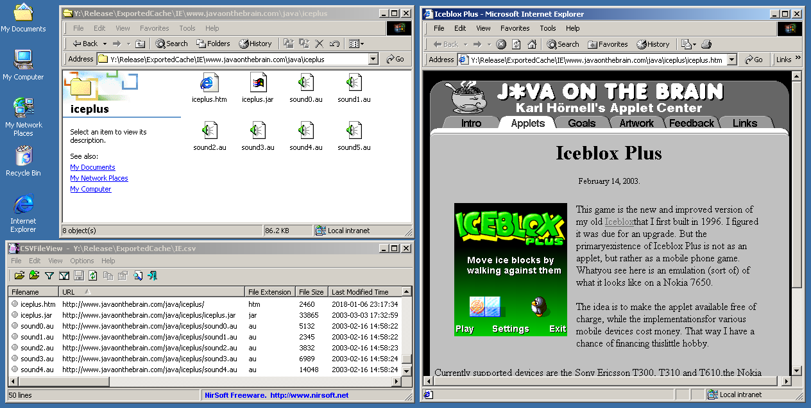
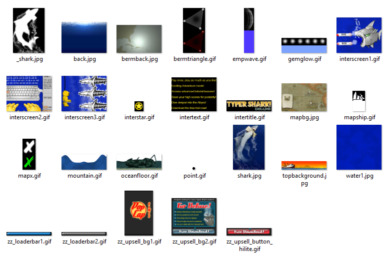

# Web Cache Exporter

This command line tool allows you to more easily view and obtain the contents of a web browser or web plugin's HTTP cache that's stored on disk. It runs on Windows 98, ME, 2000, XP, Vista, 7, 8.1, and 10, and supports the following cache formats:

* The WinINet cache - Internet Explorer 4 to 11.
* The Mozilla cache - Mozilla Firefox, Netscape Navigator 6.1 to 9, etc.
* The Flash Player's shared library cache and temporary Flash videos.
* The Shockwave Player's cache, including Xtras.
* The Java Plugin's cache - Java 1.3 to 8.
* The Unity Web Player's cache.

This tool was developed to aid the [recovery and preservation of lost web media](https://bluemaxima.org/flashpoint/) (games, animations, virtual worlds, etc) whose files might exist in old computers where they were viewed or played when they were still available.

For example, [here's a list of browser games, some of them previously lost, that were found by searching the web cache](https://docs.google.com/spreadsheets/d/1YGO5f0nXCKTE1b-fe4grhim3yIihoG81rjCPHx4puBM/edit?usp=sharing).



## Features

* Runs natively in Windows 98, ME, 2000, XP, Vista, 7, 8.1, and 10.

* Copies each cached file using their original website's directory structure.

* Creates a CSV file that lists every cached file along with additional information (URL, HTTP headers, SHA-256 hash, etc).

* Finds the default cache locations of various web browsers and web plugins.

* Supports labelling cached files based on their file signatures, MIME types, file extensions, and URLs. Files can be grouped and filtered by their format or original domain.

<!-- * Decompresses cached files based on the Content-Encoding value (Gzip, Zlib, Raw DEFLATE, Brotli) in their HTTP headers. -->

## Screenshots




## Command Line Arguments

See the [help file](readme_body.txt) to learn how to use this application.

## Building

This application is written in C-style C++03 and is compiled using the **[Build.bat](Build.bat)** batch file. See the comments at the top of this file to learn how to use and set each basic build parameter. This file is executed using the following syntax: `Build.bat [Optional Compiler Arguments]`. For example:

```
Build.bat
Build.bat /D EXPORT_EMPTY_FILES
```

In order to target Windows 98 and ME, this program is compiled using Visual Studio 2005. It's possible to skip building `WCE9x32.exe` and use Visual Studio 2015 or later by doing the following:

* Setting `VCVARSALL_PATH` to the path of the `vcvarsall.bat` batch file that is installed with Visual Studio.
* Setting `WIN9X_BUILD` to `No`. <!-- @Remove this later -->
* Setting `USE_VS_2005_OPTIONS` to `No`.

Note that this application hasn't been thoroughly tested with modern versions of Visual Studio.

This batch file can also use the [7-Zip utility](https://www.7-zip.org/download.html) to package any releases. By default, the `Build.bat` will try to run the 7-Zip executable located in the path specified by `_7ZIP_EXE_PATH`. This utility is not included with the source distribution. If you don't care about packaging the compiled application, you may disable this feature by setting `PACKAGE_BUILD` to `No`.

This project does **not** use semantic versioning.

### Dependencies

See the [Dependencies](Source/ThirdParty/Dependencies.txt) help file to learn more about any third party code used by this application.

## Resources And Tools

This section will list some useful resources and tools that were used throughout this application's development. This includes learning how to process certain cache formats, validating the application's output, extracting assets from plugin-specific file formats, and other general purpose tools.

### Internet Explorer

* [Geoff Chappell - The INDEX.DAT File Format](https://www.geoffchappell.com/studies/windows/ie/wininet/api/urlcache/indexdat.htm).
* [libmsiecf - MSIE Cache File (index.dat) format specification](https://github.com/libyal/libmsiecf/blob/master/documentation/MSIE%20Cache%20File%20%28index.dat%29%20format.asciidoc).

* [NirSoft - IECacheView - Internet Explorer Cache Viewer](https://www.nirsoft.net/utils/ie_cache_viewer.html).
* [NirSoft - A few words about the cache / history on Internet Explorer 10](https://blog.nirsoft.net/2012/12/08/a-few-words-about-the-cache-history-on-internet-explorer-10/).
* [NirSoft - Improved solution for reading the history of Internet Explorer 10](https://blog.nirsoft.net/2013/05/02/improved-solution-for-reading-the-history-of-internet-explorer-10/).

### Mozilla Firefox And Friends

* [firefox-cache-forensics - FfFormat.wiki](https://code.google.com/archive/p/firefox-cache-forensics/wikis/FfFormat.wiki).
* [dtformats - Firefox cache file format](https://github.com/libyal/dtformats/blob/main/documentation/Firefox%20cache%20file%20format.asciidoc).
* The Mozilla Firefox repository - [first](https://hg.mozilla.org/mozilla-central/file/2d6becec52a482ad114c633cf3a0a5aa2909263b/netwerk/cache) and [second](https://hg.mozilla.org/mozilla-central/file/tip/netwerk/cache2) version of the Mozilla cache format.

* [NirSoft - MZCacheView - View the cache files of Firefox Web browsers](https://www.nirsoft.net/utils/mozilla_cache_viewer.html).

### Flash Player

* [NirSoft's FlashCookiesView](https://www.nirsoft.net/utils/flash_cookies_view.html) can be used to view Flash cookies (.SOL files) where a game might save its progress or cache assets.

* [NirSoft's VideoCacheView](https://www.nirsoft.net/utils/video_cache_view.html) can be used to recover Flash videos (.FLV files) from the web cache.

### Shockwave Player

* [TOMYSSHADOW's Movie Restorer Xtra](https://github.com/tomysshadow/Movie-Restorer-Xtra) allows you to open Shockwave movies in Director. This is useful when trying to find out the name of a Shockwave game (e.g. by looking at the game's menu screen) since the plugin's cache does not store the original filename or URL.

* [Valentin's Unpack tool](https://valentin.dasdeck.com/lingo/unpack/) allows you to extract Xtras from Xtra-Packages (.W32 files). This is useful for finding out which Xtras were stored in the plugin's cache.

### Unity Web Player

* [uTinyRipper](https://github.com/mafaca/UtinyRipper) and [DerPopo's Unity Assets Bundle Extractor](https://github.com/DerPopo/UABE) can be used to extract assets from the cached AssetBundle files.

### Other

* [Geoff Chappell's software analysis website](https://www.geoffchappell.com) was also used to check the minimum supported Windows version for some functions in the Windows API.

* [NirSoft's CSVFileView](https://www.nirsoft.net/utils/csv_file_view.html) is a useful lightweight tool for viewing the resulting CSV files.

* See also [NirSoft's browser tools](https://www.nirsoft.net/web_browser_tools.html), including [ChromeCacheView](https://www.nirsoft.net/utils/chrome_cache_view.html), [OperaCacheView](https://www.nirsoft.net/utils/opera_cache_view.html), and [SafariCacheView](https://www.nirsoft.net/utils/safari_cache_view.html).

## Special Thanks

* Special thanks to Computerdude77 for his general assistance and for helping me test this tool in older Windows versions.
* Special thanks to [TOMYSSHADOW](https://github.com/tomysshadow) for his extensive Director and Shockwave knowledge.
