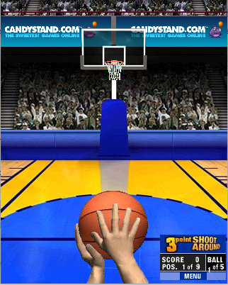
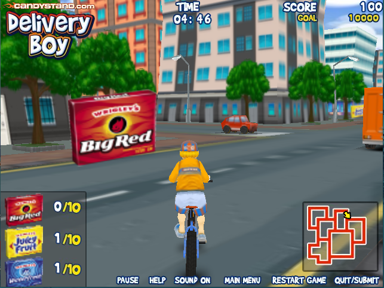
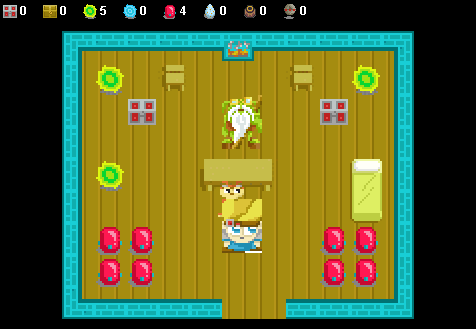
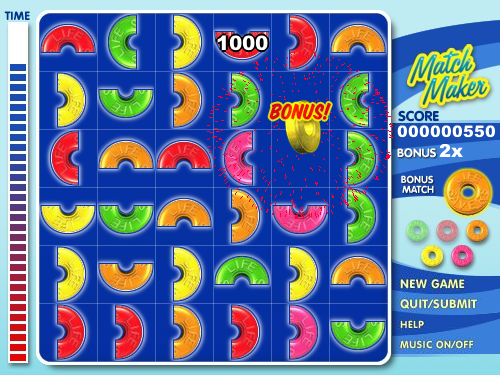
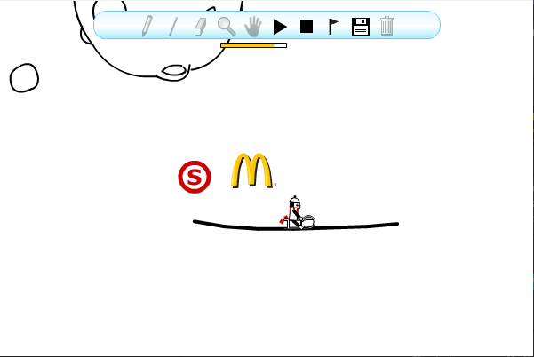
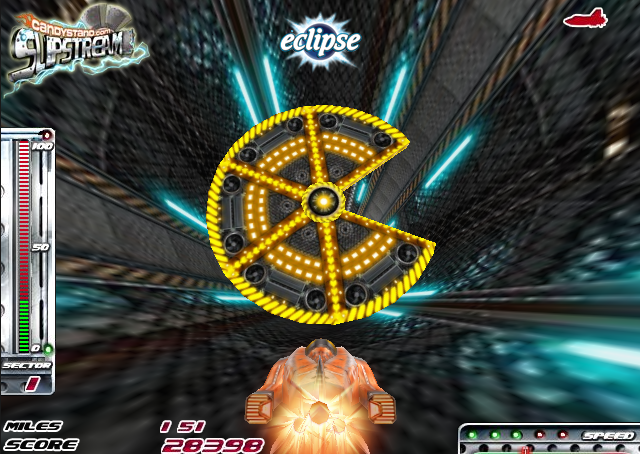

# Games Recovered By Searching The Web Cache

This page lists some browser games whose assets were lost until they were recovered from the web cache.

## 3 Point Shootout

A Shockwave game developed by "Skyworks Technologies" and published by "Candystand" on September 14th, 2007. The game was rebranded in 2009 due to a change in ownership of the [Candystand.com](https://web.archive.org/web/20081105135625/http://www.candystand.com/play.do?id=18202) website. Although the game was playable before, the branded assets were found in the web cache.

## Delivery Boy

A Shockwave game developed by "Silent Bay Studios" and published by "Candystand" on May 30th, 2008. The game was rebranded in 2009 due to a change in ownership of the [Candystand.com](https://web.archive.org/web/20081106055129/http://www.candystand.com/play.do?id=18322) website. Although the game was playable before, the branded assets were found in the web cache.

## Jak and Daxter: The Precursor Legacy - The Lost Levels

A Java game published by "Naughty Dog" in 2001. This game was an official demake of the first world from the 2001 PS2 game "Jak and Daxter: The Precursor Legacy". It was removed from the [JakAndDaxterLegend.com](https://web.archive.org/web/20080729235026/http://www.jakanddaxterlegend.com/) website in 2014.

## Life Savers Match Maker

A Shockwave game developed by "Skyworks Technologies" and published by "Candystand" in 2004. It was replaced with a Flash version in 2009 due to a change in ownership of the [Candystand.com](https://web.archive.org/web/20081127160151/http://www.candystand.com/play.do?id=17950) website. The Shockwave version was brought back and rebranded as "Match Maker Classic" in 2011, where it stayed until January 1st, 2016, when the [Candystand.com](https://web.archive.org/web/20120504000145/http://www.candystand.com/play/match-maker-classic) website was discontinued.

## Line Rider "i'm ridin' it"

A Flash game developed by "inXile Entertainment" and published by "McDonald's" on August 25th, 2008. This promotional version of "Line Rider" was made to advertise the ["Mini Size Fun Sweepstakes at McDonald's"](https://www.sweepstakesmag.com/video-games/mini-size-fun-sweepstakes-at-mcdonalds/). It was removed from the [MiniSizeFun.com](https://web.archive.org/web/20090204210827/http://minisizefun.com/) website on November 11th, 2009.

## Slipstream

A Shockwave game developed by "Silent Bay Studios" and published by "Candystand" on March 4th, 2008. It was removed from [Candystand.com](https://web.archive.org/web/20100301190013/http://www.candystand.com/play/slipstream) on January 1st, 2016, when the website was discontinued.

